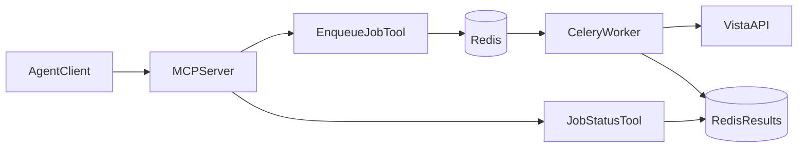

# Redis + Celery Production Plan

## Target Architecture

## Phase 1: Core async job framework

- Add Celery app bootstrap and shared queue config in new modules under [c:\Users\cforey\Desktop\vista-unapproved-invoice\server](c:\Users\cforey\Desktop\vista-unapproved-invoice\server) (e.g., `celery_app.py`, `jobs/` package).
- Add job envelope model (`job_id`, `job_type`, `status`, `submitted_at`, `started_at`, `finished_at`, `result`, `error`) and Redis-backed lifecycle helpers in a new `server/jobs` module.
- Extend settings in [c:\Users\cforey\Desktop\vista-unapproved-invoice\server\config.py](c:\Users\cforey\Desktop\vista-unapproved-invoice\server\config.py) for broker/result URLs, queue names, worker rate limits, task timeouts, and result TTL.
- Ensure worker-side API client creation uses existing retry/throttle controls from [c:\Users\cforey\Desktop\vista-unapproved-invoice\server\api.py](c:\Users\cforey\Desktop\vista-unapproved-invoice\server\api.py), with explicit per-task lifecycle management.

## Phase 2: MCP tools for async execution

- Refactor duplicate analysis logic from [c:\Users\cforey\Desktop\vista-unapproved-invoice\server\tool_factory.py](c:\Users\cforey\Desktop\vista-unapproved-invoice\server\tool_factory.py) into reusable service code (`server/services/duplicate_analysis.py`) used by Celery task + optional sync fallback.
- Replace direct heavy execution with async MCP tools:
  - `submit_duplicate_invoice_analysis_job`
  - `get_job_status`
  - `get_job_result`
  - `cancel_job` (best-effort state transition)
- Add a generalized job submission path in `tool_factory` so additional heavy tools can be registered as async jobs without repeating queue plumbing.
- Preserve current light endpoint tools as synchronous to avoid unnecessary complexity.

## Phase 3: Throughput, fairness, and safety

- Add per-tool and per-enterprise concurrency/rate controls in the job submission layer to prevent queue flooding.
- Add dedupe/idempotency key support (same request payload within a short window returns existing `job_id`).
- Add chunking strategy for large scans (`list_limit` partitioning) and bounded worker fan-out for invoice detail fetches.
- Add job retention and cleanup policy (result TTL + periodic cleanup task).

## Phase 4: Production packaging and operations

- Add dependencies and worker entrypoints in [c:\Users\cforey\Desktop\vista-unapproved-invoice\pyproject.toml](c:\Users\cforey\Desktop\vista-unapproved-invoice\pyproject.toml).
- Add production container files at repo root: `Dockerfile` and `docker-compose.yml` with `mcp`, `worker`, and `redis` services.
- Update env templates in [c:\Users\cforey\Desktop\vista-unapproved-invoiceenv.example](c:\Users\cforey\Desktop\vista-unapproved-invoice.env.example) for Celery/Redis settings and sane defaults.
- Document startup/runbook and scaling knobs in [c:\Users\cforey\Desktop\vista-unapproved-invoice\README.md](c:\Users\cforey\Desktop\vista-unapproved-invoice\README.md) (local dev + production compose).

## Phase 5: Testing and verification

- Add unit tests for job lifecycle and task orchestration under [c:\Users\cforey\Desktop\vista-unapproved-invoice\tests](c:\Users\cforey\Desktop\vista-unapproved-invoice\tests).
- Add integration tests for submit/status/result MCP flow with mocked Celery execution.
- Add regression tests ensuring current sync endpoint behavior remains unchanged.
- Validate load behavior with concurrent submit/status polling scenarios and confirm bounded upstream Vista request rates.

